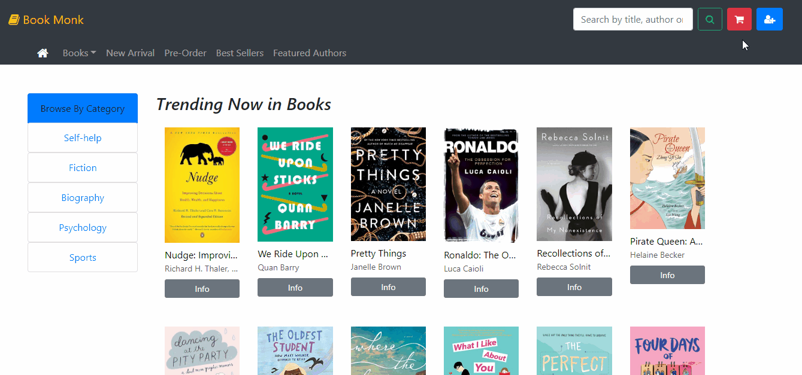

# :books: E Commerce Book Store

Building a online book store 

## :arrow_right: Technologies Used:

:one: Node

:two: Express

:three: React + Redux

:four: MySQL


## :arrow_right: Get Started

Clone the repository

`git clone https://github.com/maheshkhatana/E-commerce-Book-Store`

In the project directory(E -Commerce Book Store)

`npm install`

In the client directory

`npm install`

In the root directory, inside the server/.env file, set the following fields
```
module.exports = {
JWT_SECRET='xxxxxxxxxxxxxxxxxx'
CLIENT_ID='xxxxxxxxxxxxxxxxxxx Google OAuth Client ID xxxxxxxxxxxxxxxxxxxxxx'
CLIENT_SECRET='xxxxxxxxxxxxxxxxxx Google OAuth Secret Id xxxxxxxxxxxxx'
STRIPE_SC_KEY='xxxxxxxxxxxxxxxxxx Stripe Secret Key xxxxxxxxxxxxx'
MAILJET_PUBLIC_KEY='xxxxxxxxxxxxxxxxxx MailJet Public Key xxxxxxxxxxxxx'
MAILJET_SECRET_KEY='xxxxxxxxxxxxxxxxxx MailJet Secret Key xxxxxxxxxxxxx'
}
```

In the client directory, inside the ./src/config/keys.js file, set the following fields
```
module.exports = {
    CLIENT_ID: 'xxxxxxxxxxxxxxxxxxx Google OAuth Client ID xxxxxxxxxxxxxxxxxxxxxx',
     STRIPE_PS_KEY: 'xxxxxxxxxxxxxxxxxx Stripe Public Key xxxxxxxxxxxxx'
}
```

Import the book_monk.sql( stored inside server/models/book_monk.sql) into your MySQL database or create your own Database


To run the application, in the root dirctory

`npm run start-dev`


## :arrow_right: Demo


HomePage


Login





Add to Cart and Checkout


